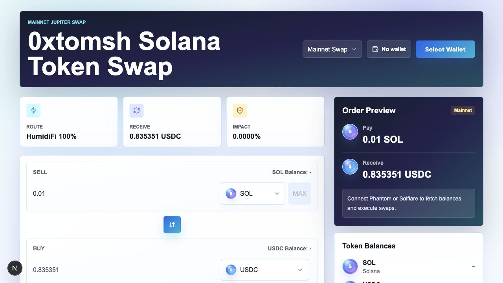

# Next.js Token Swap

Solana token swap interface built with Next.js, React, Tailwind CSS, Solana Wallet Adapter, and Jupiter Swap API.



## Features

- Phantom and Solflare wallet connection.
- Network selector for mainnet-beta, devnet, and testnet.
- Fixed token list: SOL, USDC, USDT, BONK.
- SOL and SPL token balance display for the connected wallet.
- Mainnet Jupiter quote display: expected output, minimum received, price impact, route, and slippage.
- Mainnet real swap execution with Jupiter `/quote`, Jupiter `/swap`, wallet signature, `sendRawTransaction`, and `confirmTransaction`.
- Devnet mock swap mode with Jupiter-like quote, wallet message approval, simulated execution, and mock history.
- Preset and custom slippage settings.
- Confirmation modal before signing or mock approval.
- Success result with transaction signature, Solscan link when applicable, swap details, balance refresh, and local swap history.
- Error messages for insufficient balance, slippage movement, user rejection, route failures, and RPC confirmation errors.

## Network Support

| Network | RPC | Swap behavior | Explorer |
| --- | --- | --- | --- |
| Mainnet-beta | Mainnet RPC | Real Jupiter quote and transaction submission. | Solscan mainnet transaction links. |
| Devnet | Devnet RPC | Mock Jupiter-like quote and wallet message approval. No tokens move. | Solscan devnet cluster links for non-mock transactions. |
| Testnet | Testnet RPC | Wallet and balance mode only. | Solscan testnet cluster links for non-mock transactions. |

Devnet intentionally does not submit swap transactions. It mirrors the user flow as closely as possible without moving funds: quote, route display, slippage, confirmation, wallet approval, simulated execution, and history entry.

## Commands

```bash
pnpm --filter nextjs-token-swap dev
pnpm --filter nextjs-token-swap typecheck
pnpm --filter nextjs-token-swap build
```

From the repository root:

```bash
pnpm dev:nts
pnpm typecheck:nts
pnpm build:nts
```

## Environment

Optional variables:

```bash
NEXT_PUBLIC_SOLANA_RPC_URL=https://your-mainnet-rpc.example
NEXT_PUBLIC_SOLANA_MAINNET_RPC_URL=https://your-mainnet-rpc.example
NEXT_PUBLIC_SOLANA_DEVNET_RPC_URL=https://your-devnet-rpc.example
NEXT_PUBLIC_SOLANA_TESTNET_RPC_URL=https://your-testnet-rpc.example
JUPITER_API_KEY=your-jupiter-api-key
JUPITER_API_BASE_URL=https://api.jup.ag/swap/v1
```

Without `JUPITER_API_KEY`, the app uses `https://lite-api.jup.ag/swap/v1`. For production, use an API key from Jupiter Portal and set `JUPITER_API_BASE_URL` to `https://api.jup.ag/swap/v1`.

## Token Accounts

The app does not manually create associated token accounts. Jupiter's serialized swap transaction can include setup instructions for missing receive-side token accounts when possible. Users still need enough SOL to cover network fees and any token account rent.

The fixed SPL token mint list is the canonical mainnet token list used for Jupiter swaps. If you mint custom devnet/testnet SPL tokens for testing, replace or extend the token list in `app/token-swap.tsx` with those mint addresses.

## File Guide

| File | Purpose |
| --- | --- |
| `app/token-swap.tsx` | Main swap UI, balance loading, quote handling, real swap execution, devnet mock execution, history, and error states. |
| `app/wallet-providers.tsx` | Solana wallet providers, network selection context, RPC endpoints, and wallet adapter setup. |
| `app/api/jupiter/quote/route.ts` | Server-side proxy for Jupiter quote requests. |
| `app/api/jupiter/swap/route.ts` | Server-side proxy for Jupiter swap transaction creation. |
| `app/globals.css` | Tailwind entrypoint, app background, and wallet button styling. |
