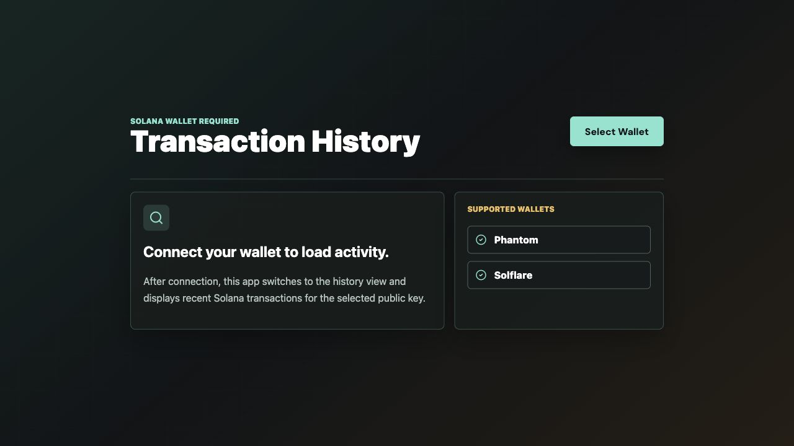

# React Solana Transaction History

Vite React app for connecting a Solana wallet and displaying recent transaction history.



## Features

- Wallet connection waiting screen.
- Connected wallet transaction history screen.
- Recent mainnet signatures fetched with `getSignaturesForAddress`.
- Parsed transaction details fetched with `getParsedTransactions`.
- Copy address, refresh history, and open wallet or transaction in Solana Explorer.
- Optional `VITE_SOLANA_RPC_URL` support for a dedicated RPC provider.

## Commands

```bash
pnpm --filter react-solana-transaction-history dev
pnpm --filter react-solana-transaction-history typecheck
pnpm --filter react-solana-transaction-history build
```

From the repository root:

```bash
pnpm dev:rth
pnpm typecheck:rth
pnpm build:rth
```

The app runs at `http://localhost:5173` unless that port is already in use.

## Environment

To avoid public RPC limits, create `.env.local`:

```bash
VITE_SOLANA_RPC_URL=https://your-rpc-provider.example
```

## File Guide

| File | Purpose |
| --- | --- |
| `src` / app source files | React UI, wallet connection state, and transaction history rendering. |
| `vite.config.ts` | Vite development and build configuration. |
| `package.json` | App scripts and dependencies. |
