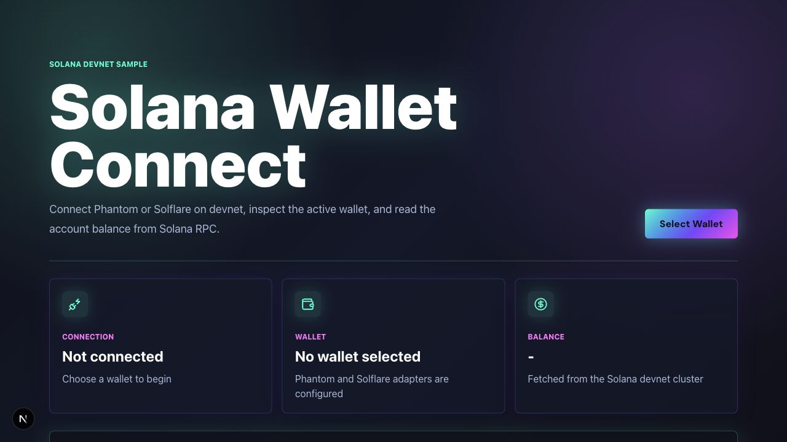

# Solana Wallet Connection

Next.js + Tailwind CSS sample for connecting a Solana wallet on devnet.



## Features

- Connect with Phantom or Solflare through Solana Wallet Adapter.
- Show connection state, selected wallet, public key, and devnet SOL balance.
- Copy the public key.
- Open the connected account in Solana Explorer.
- Uses devnet by default, so it is safe for connection and balance-reading demos.

## Commands

```bash
pnpm --filter solana-wallet-connection dev
pnpm --filter solana-wallet-connection typecheck
pnpm --filter solana-wallet-connection build
```

From the repository root:

```bash
pnpm dev:swc
pnpm typecheck:swc
pnpm build:swc
```

## File Guide

| File | Purpose |
| --- | --- |
| `app/page.tsx` | Composes wallet providers and dashboard UI. |
| `app/wallet-providers.tsx` | Configures Solana Wallet Adapter, devnet RPC, Phantom, and Solflare. |
| `app/wallet-dashboard.tsx` | Visible dashboard for wallet status, balance, public key, copy action, and explorer link. |
| `app/globals.css` | Tailwind entrypoint, wallet adapter styles, and app-level visual styling. |
| `next.config.ts` | Turbopack root configuration for the pnpm monorepo. |

## Turbopack Notes

This app uses Turbopack for development and production builds. In this pnpm monorepo, the repository root also declares `next`, `react`, and `react-dom` as dev dependencies so Turbopack can resolve the Next.js package from the configured workspace root.

If Turbopack reports `Next.js package not found`, run these from the repository root:

```bash
pnpm install
rm -rf solana-wallet-connection/.next
pnpm dev:swc
```
